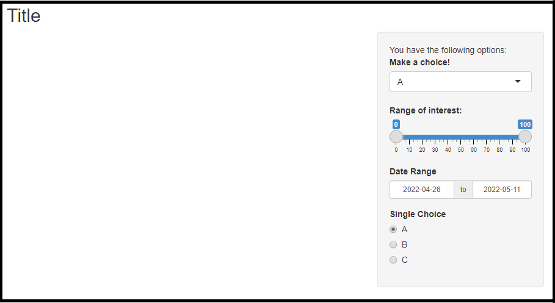
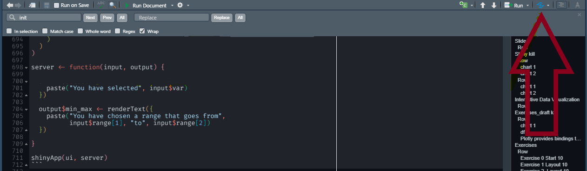

```{r setup, include=FALSE}
knitr::opts_chunk$set(echo = FALSE)
library(flexdashboard)
#library(shiny)
library(dplyr)
library(plotly)
#options(display.mode = "showcase")
library(bslib)

```


<style>
  .nav-tabs-custom > .nav-tabs > li.active {border-top-color: blue;}
  .shiny-frame {height: 1000px !important;}
  #section-test {height: 5000px !important;}
  #section-exercises {height: 1100px !important;}
  #section-exercise-0-start-10 {height: 5000px !important;}
  #section-exercise-11-observers-update-input-20-min {height: 5000px !important;}
  <!-- Commented out for redudancy
  .nav-tabs-custom > .iframe {height: 1000px !important; }
  .iframe {height: 1000px !important;}
  -->
  .nav-tabs-custom > .nav-tabs > li.active > a {color: blue;} 
  .nav-tabs-custom > .nav-tabs > li > a {font-size: 13px !important}
</style>

<script>
$('.navbar-logo').appendTo('ul.nav:nth-child(2) ');

$('.navbar-logo').wrap('<a href="https://github.com/hdbt/interactive_dataviz/archive/refs/heads/master.zip">');
function toggle(className, displayState){
    var elements = document.getElementsByClassName(className)

    for (var i = 0; i < elements.length; i++){
        elements[i].style.display = displayState;
    }
};
$('#1').appendTo('ul.nav-tabs:nth-child(2)');

function switchlol(){
  if(document.getElementById("1").value=="OFF"){
   toggle('sourceCode', 'none');
   document.getElementById("1").value="ON";}

  else if(document.getElementById("1").value=="ON"){
   toggle('sourceCode', 'block');
   document.getElementById("1").value="OFF";}
};

</script>


Slides {data-orientation=rows}
=====================================


Row {data-width = 1200}
-------------------------------------


```{r, dpi= 240}
knitr::include_url('slides/slides1.html', height = "800px")
```


Interactive Data Visualization {data-orientation=rows}
=====================================

Row {.tabset .tabset-fade data-height=3500}
-------------------------------------


```{r dpi=350 }
knitr::include_url('interactive_viz.html', height = "1200px")
```


Exercises 
===========================================

Row {.tabset .tabset-fade}
-------------------------------------------


### Exercise 0 Start 10

 <button onclick="switchlol();" id="1" value="ON" class="btn btn-primary btn-lg" data-toggle="button" aria-pressed="false" autocomplete="off">Hide Code</button> 

1.    `install.packages("shiny")`
2.    Create an `app.R` file in RStudio. 
3.    Copy & paste the geyser app code below in your created file.
4.    Run the app on your system.


```{r eval=TRUE, echo = TRUE}
library(shiny)

# Define UI for app that draws a histogram ----
ui <- fluidPage(

  # App title ----
  titlePanel("Hello I am the geyser app!"),

  # Sidebar layout with input and output definitions ----
  sidebarLayout(

    # Sidebar panel for inputs ----
    sidebarPanel(

      # Input: Slider for the number of bins ----
      sliderInput(inputId = "bins",
                  label = "Number of bins:",
                  min = 1,
                  max = 50,
                  value = 30)

    ),

    # Main panel for displaying outputs ----
    mainPanel(

      # Output: Histogram ----
      plotOutput(outputId = "distPlot")

    )
  )
)

# Define server logic required to draw a histogram ----
server <- function(input, output) {

  # Histogram of the Old Faithful Geyser Data ----
  # with requested number of bins
  # This expression that generates a histogram is wrapped in a call
  # to renderPlot to indicate that:
  #
  # 1. It is "reactive" and therefore should be automatically
  #    re-executed when inputs (input$bins) change
  # 2. Its output type is a plot
  output$distPlot <- renderPlot({

    x    <- faithful$waiting
    bins <- seq(min(x), max(x), length.out = input$bins + 1)

    hist(x, breaks = bins, col = "#75AADB", border = "white",
         xlab = "Waiting time to next eruption (in mins)",
         main = "Histogram of waiting times")

    })

}

shinyApp(ui = ui, server = server, options = list(display.mode = "showcase"))
```


### Exercise 1 Basic Layout I (10 min)

0. Create a RMarkdown document and use chunks to execute the code. 

1. Create a basic layout using the following layout functions to create a basic app layout and fill it with some text:

`fluidpage()`

`titlePanel()`

`sidebarLayout()`

`sidebarPanel()`

`mainPanel()`

2. Use at least three different HTML tag functions of your choice e.g.`tags$h1` in your layout.

3. install the package [`bslib`](https://rstudio.github.io/bslib/).  Make use of the `theme` argument of `fluidPage` and use a bootstrap theme of your [choice](https://bootswatch.com/). 

Tip 1. you may use `bs_theme(bootswatch = "quartz")` as a theme.

### 

### Exercise 3. Inputs. Recreate the UI.  (10 min.)

Recreate the following UI. 


```{r figurename, echo=FALSE, eval = TRUE}

```


### Exercise 4.0 Your first Shiny App

Create an app that greets the user by name. You don’t know all the functions you need to do this yet, so I’ve included some lines of code below. Think about which lines you’ll use and then copy and paste them into the right place in a Shiny app.

```{r, eval = FALSE, echo=TRUE}
tableOutput("mortgage")
output$greeting <- renderText({
  paste0("Hello ", input$name)
})
numericInput("age", "How old are you?", value = NA)
textInput("name", "What's your name?")
textOutput("greeting")
output$histogram <- renderPlot({
  hist(rnorm(1000))
}, res = 96)
```


### Exercise 4.1  Why will this code fail?  2(min)

Why will this code fail? 

Why are `range` and `var` bad names?

```{r, eval=FALSE, echo = TRUE}
Because of namespace conflicts of range()
var <- reactive(df[[input$var]])
range <- reactive(range(var(), na.rm = TRUE))
```


### Exercise 4.2 Outputs and Reactives (5 min)

Fix the three simple errors found in the following app.

```{r message=FALSE, warning=FALSE, eval=FALSE, echo=TRUE}
library(shiny)
ui <- fluidPage(
  textInput("name", "Whats's your name?"),
  textOutput("greeting")
)

server <- function(input, session){
  output$"greeting" <- renderText(paste("Hello", name))
  
}
shinyApp(ui, server)


```

### Exercise 4.3  Outputs and Reactives (5 min)

Fix the error in this app. Read the error message carefully to see what's missing in the server function.

Tip 1: Remember, that reactive objects are called like functions with `()`. See slide 19 for an example.

```{r message=FALSE, warning=FALSE, eval=FALSE, echo=TRUE}
library(shiny)
ui <- fluidPage(
  textInput("name", "Whats's your name?"),
  textOutput("greeting")
)

server <- function(input, output, session){
  greeting <- paste("Hello", input$name)
  
  output$greeting <- renderText(greeting)
  
}
shinyApp(ui, server)

```

### Exercise 4.4 Fix the bugs  (5 min.)

There are two bugs in the code provided below. Can you find and fix them?

```{r, echo=TRUE, eval = FALSE, echo = TRUE}
library(shiny)
library(ggplot2)

datasets <- c("economics", "faithfuld", "seals")
ui <- fluidPage(
  selectInput("dataset", "Dataset", choices = datasets),
  verbatimTextOutput("summary"),
  tableOutput("plot")
)

server <- function(input, output, session) {
  dataset <- reactive({
    get(input$dataset, "package:ggplot2")
  })
  output$summary <- renderPrint({
    summary(dataset())
  })
  output$plot <- renderPlot({
    plot(dataset)
  }, res = 96)
}

shinyApp(ui, server)
```


### Exercise 5.  Graph I

1. Use the histogram app from exercise 0 to include an input selector in the ui, which enables the user to choose any variable in a data set to plot a histogram. 

Tip 1. Use `data(diamonds, package = "ggplot2")` to load the diamonds data set.

Tip 2. Use `names(diamonds)` to get the names of the columns for the input choices.

Tip 3. use `[[var]]` to subset the data frame. (equivalent to `$var`)


### Exercise 6.  Plot (10 min.)

Based on the app in Exercise 5 now include two variables to plot a scatter plot.


### Exercise 7.  ggplot (15 min.)

Based on the app from Exercise 0 or 5 create an app that plots ggplot(diamonds, aes(carat)) but allows the user to choose which geom to use: geom_histogram(), geom_freqpoly(), or geom_density().  

Tip 1. ggplot uses [non-standard evaluation](https://mastering-shiny.org/action-tidy.html?q=ggplot#data-masking). Use `diamonds, aes(x = .data[[input$col]])`instead of `diamonds[[input$col]]` for ggplot functions. 

Tip 2. geom_histogram() and geom_freqpoly() have a binwidth argument; geom_density() has a bw argument.

### Exercise 8. download (5 min.)

Based on the app of exercise 5 include a download button and let the user download the data set.

Tip 1: Read the [documentation](https://rdrr.io/cran/shiny/man/downloadHandler.html) about the download handler of shiny.

### Exercise 9.  bootstrap (10 min.)

Use the bslib package to [customize](https://rstudio.github.io/bslib/articles/bslib.html) your bootstrap theme of an app of your choice. 
Use [thematic](https://rstudio.github.io/thematic/) so your outputs also adapt to the new theme.


```{r, eval= FALSE, echo=TRUE}
library(bslib)
bs_theme_preview( bs_theme())  # check the console for the generated code
```


### Exercise 10. Deploying your App to the Web (10 min.)


  1.  Go to <https://www.shinyapps.io> and create an account or log in
      with Google/GitHub
  
  2.  Follow the instructions for connecting your machine to the server.
  
  3.  Publish the app from Exercise 0.

You can find [here](https://shiny.rstudio.com/articles/shinyapps.html) further information on how to deploy your app and how shinyapps.io works in general.

```{r}

```

### Exercise 11. observers update input 20 min.

 <button onclick="switchlol();" id="1" value="ON" class="btn btn-primary btn-lg" data-toggle="button" aria-pressed="false" autocomplete="off">Hide Code</button> 


1. The lable for the selection for bin width slider says "Number of bins. This is actually only true for the Histogram and Frequency plot. The Density curve uses the parameter "band with". Use an observer to update the label of the slider accordingly. I.e. it should display "Bandwith", when Density is selected and "Number of bins" if any other Plot type is selected.

* Tip 1. Think about the type of observer  you'll need. [observe()](https://shiny.rstudio.com/reference/shiny/0.14/observe.html) or [observeEvent()](https://shiny.rstudio.com/reference/shiny/1.0.3/observeEvent.html) 
* Tip 2. Use `label = ifelse(input$geom == "dens", "Bandwidth", "Number of Bins")` as an argument for your updated slider.
* Tip 3. Use an [update function](https://shiny.rstudio.com/reference/shiny/0.14/updateSelectInput.html) in your server function to update any parameters of control widgets.

2. As of now the plot reacts to every change you make (variables, plot type and bins / bandwith). Create a button, so any changes in the parameters are only applied after you trigger the button. 

* Tip 1. There are at least three solutions to this. `isolate()` is very helpful in this case. 

```{r eval = TRUE, echo = TRUE}

library(shiny)
library(ggplot2)
library(shinyWidgets)

data(diamonds, package = "ggplot2")
selection <-  names(diamonds)[vapply(diamonds, is.numeric, logical(1))]

ui <- fluidPage(
tags$style("@import url(https://use.fontawesome.com/releases/v6.1.1/css/all.css);")  ,

# Application title
    titlePanel("Diamonds Dataset"),

    # Sidebar with a slider input for number of bins 
    sidebarLayout(
        sidebarPanel(
          selectInput("col", "Product", choices = selection),
          selectInput("geom", "Plottype", choices = list(Histogram = "hist", Frequency = "freq", Density = "dens")),
          sliderInput("bins",
                      "Number of bins:",
                      min = 0.1,
                      max = 10,
                      value = 1, 
                      step = .01),
          prettyToggle(
           inputId = "Id031",
           label_on = "Flipped!", 
           label_off = "Not flipped!",
           outline = TRUE,
           plain = TRUE,
           icon_on = icon("chart-bar", lib = "font-awesome"), 
            icon_off = icon("chart-column", lib = "font-awesome"))
        ),
        

        # Show a plot of the generated distribution
        mainPanel(
           plotOutput("distPlot")
        )
    )

)

server <- function(input, output, session) {
  
  observeEvent(input$Id031, {
    updateSelectInput(session, inputId = "col",label = "Test" )
  }, ignoreInit = TRUE
  )
  


    output$distPlot <- renderPlot({
      p <-  ggplot(diamonds, aes(x = .data[[input$col]]))
      
      if (input$Id031) {
      p <-  p + coord_flip()
      }
      
      if (input$geom == "hist") {
        
      p + geom_histogram(binwidth =  input$bins) 
        
      }
      else if (input$geom == "freq") {
      p + geom_freqpoly(binwidth =  input$bins)
      }
      else {
      p + geom_density(bw =  input$bins)
 
      }

      
    })

  
  
}

shinyApp(ui, server)

```


###  Exercise 12. Output is Input (10 min.)

As you can see you can use your output as a source of input!

Replace the rendered table by another output of your choice (histograms, boxplots, density curves,... ).

Tip. Remember, that [`brushedPoints()`](https://rdrr.io/cran/shiny/man/brushedPoints.html) selects rows across columns. Because of this determine variable of interest in your code or make it interactive with an input selector in your ui. 

```{r echo = TRUE}
library(shiny)
library(ggplot2)

ui <- fluidPage(
  plotOutput("plot", brush = "plot_brush"),
  tableOutput("data")
)
server <- function(input, output, session) {
  output$plot <- renderPlot({
    ggplot(mtcars, aes(wt, mpg)) + geom_point()
  }, res = 96)
  
  output$data <- renderTable({
    brushedPoints(mtcars, input$plot_brush)
  })
}
shinyApp(ui, server)
```


###  Exercise 13.  (20 min.)


Go to the section "Interactive Data Visualization" and copy&paste one of the interactive plots into your RMarkdown document. 

1. Create an rmarkdown document, format it with some basic syntax. 
2. Render a [html doc](https://bookdown.org/yihui/rmarkdown/html-document.html) with the interactive plot. 
3. Render a [ioslide presentation](https://bookdown.org/yihui/rmarkdown/ioslides-presentation.html) using the same interactive graphs.
4. Install [flexdashboard](https://pkgs.rstudio.com/flexdashboard/) with `install.packages("flexdashboard")` and render a dashboard with an interactive plot of your choice. You may find an RMarkdown document template for your dashboard in RStudio with `New File --> R Markdown --> From Template --> Flex Dashboard`


### Exercise 14. Data tables (5 min.)

Go to the section "Interactive Data Visualization" and copy & paste the code into your R Markdown document.

1. delete or comment out the 4th line of this code chunk.
What difference does this make in terms of computation and usability? 
What's going on here?


Example invalidateLater() for Scheduled Updates
===========================================

Row
------------------------------------------


```{r  tidy=TRUE}
library(shiny)
library(highcharter)
library(shinythemes)
library(dplyr)
library(tidyverse)


ui <- fluidPage(
  theme = shinytheme("paper"),
  sliderInput("n", "N", 5, 500, 20, 1),
  highchartOutput("hc_opts2"),
  checkboxInput("run", "Start")
)


server <- function(input, output, session) {
     
  
  df_fake <- reactive(tibble(x = runif(input$n,0,100), y = x * 2 + rnorm(input$n, sd= 50)))
  
  df <- reactive({
    lm_fit <- lm(y ~ x, data = df_fake())
    fit <- fitted(lm_fit)
    fit_conf <- predict(lm_fit, data.frame(x  = df_fake()$x) , se.fit=TRUE, interval="confidence", level = 0.90)
    coeffs <-  coef(summary(lm_fit))
    mutate(df_fake(), fit =  fit, low = fit - 2*coeffs[2,2] , high = fit + 2*coeffs[2,2]  ) 
    
})


  
  output$hc_opts2 <- renderHighchart({
    
    input$reset
    highchart() %>%  hc_yAxis(max = max(df()$y), min = min(df()$y)) %>%
       hc_add_series(
        data = df(),
        id = "fit",
        name = "Fit",
        type = "line",
        hcaes(x = x, y = fit)
        # colorByPoint = TRUE
        ) %>%
      hc_add_series(
        data = df(), 
        id = "london", 
        name = "Data", 
        type = "scatter",
        hcaes(x = x, y = y)
        # colorByPoint = TRUE
        ) %>%

       hc_xAxis(categories = seq_along(1:isolate(input$n)))
    
  })
  
  autoInvalidate <- reactiveTimer(500)

  
  observe({ if(input$run) { invalidateLater(500) }
    lm_fit <- lm(y ~ x, data = df_fake())
    fit <- fitted(lm_fit)
    coeffs <-  coef(summary(lm_fit))
    dfs <- mutate(isolate(df_fake()), fits = x * rnorm(1,coeffs[2,1], coeffs[2,2]) + rnorm(1, coeffs[1,1], coeffs[1,2]) ) 
    
    highchartProxy("hc_opts2") %>%
      hcpxy_set_data(
        data = dfs, 
        type = "line",
        mapping = hcaes(x = x, y = fits),
        redraw = TRUE

        # colorByPoint = TRUE
      )
  })
}
  
shinyApp(ui, server)
```

