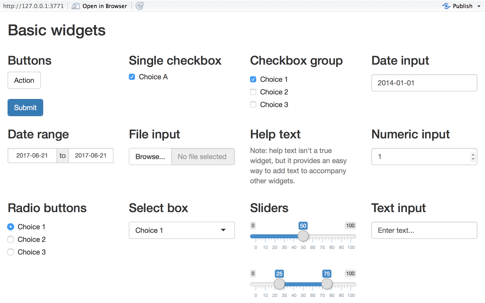

```{r setup, include=FALSE}
knitr::opts_chunk$set(echo = FALSE)
```

## Course goals

1.  Be able to write & deploy shiny apps

2.  Have a broad understanding of what shiny's capabilities

3.  Be familiar with popular interactive data viz frameworks and know
    how to render them

4.  help for self-help

### Requirement for 1 ECTS point:

-   write your own shiny app or flexdashboard and present it in session
    II

## Course structure

-   First Session

    -   Introduction to Shiny

    -   Shiny examples & exercises

    -   Discuss presentations

-   Second Session

    -   RMarkdown, interactive documents, slides and dashboards

        -   Highcharts, Plotly & ggplot

    -   Peek into advanced appliances

        -   Upgrade with HTML, CSS, JS

    -   Presentations

    -   Further pointers

## Course materials 

[Shiny tutorials by RStudio](https://shiny.rstudio.com/tutorial/) -
Videos and written tutorials to basic functionalities of shiny

[Mastering Shiny Build interactive Apps, Reports & Dashboards Powered by
R](https://mastering-shiny.org)

-   Very good guide for basic & advanced mechanics of shiny by Hadley
    Wickham (Tidyverse Guy)

Shiny cheatsheet, available from
<https://www.rstudio.com/resources/cheatsheets/> {width="500"}

[R Markdown: THe Definitive Guide](https://bookdown.org/yihui/rmarkdown/)

## My first steps in shiny I

{width="850"}

## My first steps in shiny II

```{=html}
<script src="https://code.highcharts.com/highcharts.js"></script>
```
```{=html}
<script src="https://code.highcharts.com/modules/exporting.js"></script>
```
```{=html}
<script src="https://code.highcharts.com/modules/export-data.js"></script>
```
```{=html}
<script src="https://code.highcharts.com/modules/accessibility.js"></script>
```
<figure class="highcharts-figure">

::: {#container}
:::

<p class="highcharts-description">

Chart showing data updating every second, with old data being removed.

</p>

</figure>

```{js}
Highcharts.chart('container', {
    chart: {
        type: 'spline',
        animation: Highcharts.svg, // don't animate in old IE
        marginRight: 10,
        events: {
            load: function () {

                // set up the updating of the chart each second
                var series = this.series[0];
                setInterval(function () {
                    var x = (new Date()).getTime(), // current time
                        y = Math.random();
                    series.addPoint([x, y], true, true);
                }, 1000);
            }
        }
    },

    time: {
        useUTC: false
    },

    title: {
        text: 'Live random data'
    },

    accessibility: {
        announceNewData: {
            enabled: true,
            minAnnounceInterval: 15000,
            announcementFormatter: function (allSeries, newSeries, newPoint) {
                if (newPoint) {
                    return 'New point added. Value: ' + newPoint.y;
                }
                return false;
            }
        }
    },

    xAxis: {
        type: 'datetime',
        tickPixelInterval: 150
    },

    yAxis: {
        title: {
            text: 'Value'
        },
        plotLines: [{
            value: 0,
            width: 1,
            color: '#808080'
        }]
    },

    tooltip: {
        headerFormat: '<b>{series.name}</b><br/>',
        pointFormat: '{point.x:%Y-%m-%d %H:%M:%S}<br/>{point.y:.2f}'
    },

    legend: {
        enabled: false
    },

    exporting: {
        enabled: false
    },

    series: [{
        name: 'Random data',
        data: (function () {
            // generate an array of random data
            var data = [],
                time = (new Date()).getTime(),
                i;

            for (i = -19; i <= 0; i += 1) {
                data.push({
                    x: time + i * 1000,
                    y: Math.random()
                });
            }
            return data;
        }())
    }]
});
```

## What is Shiny? I

> [Shiny](https://shiny.rstudio.com/) is a framework for creating web
> applications using R code. It is designed primarily with data
> scientists in mind, and to that end, you can create pretty complicated
> Shiny apps with no knowledge of HTML, CSS, or JavaScript. On the other
> hand, Shiny doesn't limit you to creating trivial or prefabricated
> apps: its user interface components can be easily customized or
> extended, and its server uses reactive programming to let you create
> any type of back end logic you want. Shiny is designed to feel almost
> magically easy when you're getting started, and yet the deeper you get
> into how it works, the more you realize it's built out of general
> building blocks that have strong software engineering principles
> behind them.
>
> -   Hadley Wickham

-   Package for creating web-apps

```{r echo = TRUE}
library(shiny)

```

## What is Shiny? II

-   Gives you easy Framework for deploying interactive R Code to
    everbody, without learning any other language than R

    -   you write the R code and shiny creates the app

    -   But if you know some HTML,CSS or JS you can easily utilize this.
        (easy to learn anyway)

    -   interactive app, that takes inputs from the user and updates the
        outputs accordingly

-   Every shiny app consists of two components

    -   Userinterface (UI) = The body of your app
    -   Server => The brain of your app
    
## What happens when I go to visit a shiny app?

{width="950"}
Shiny is taking care of everything; especially the websockets.

## Shiny Examples 

<https://shiny.rstudio.com/gallery/>

-   [COVID-19 Tracker](https://shiny.rstudio.com/gallery/covid19-tracker.html)
-   [Create IOS & Android Apps](https://rinterface.github.io/shinyMobile/)
-   [Build Shiny with Shiny](https://shiny.rstudio.com/gallery/shiny-wysiwyg.html)
-   [Machine Learning with Shiny](https://shiny.rstudio.com/gallery/radiant.html)
-   [Official New Zealand Government Dashboard](https://statisticsnz.shinyapps.io/trade_dashboard/)
-   [A simple Game with Shiny](https://sparktuga.shinyapps.io/ShinyDecisions/)

## Basic Structure

```{r echo = TRUE}
library(shiny)

ui <- fluidPage(
  "Hello, world!"
)

server <- function(input, output, session) {
}

shinyApp(ui, server)

```

## App Structure

### UI: Layout

User interface (front end) - Controls layout and appearance of your app
- placing and displaying - inputs(e.g. scroll bars, buttons, text input)
and - outputs (e.g. plot, text)

We basically create an HTML document with r syntax. Example:

```{r echo = TRUE}
library(shiny)
ui <- fluidPage(
  "Hello, world!"
)

message(ui)
```

## Layout

Provides high-level visual structure

Hierarchy of function calls (Waterfall principle + nested)

fluidPage(), fixedPage() or fillPage() ---> provides basic HTML and CSS
structure (think of it like a skeleton)

More complex customization need "Layout functions" and are nested inside
fluidpage

{width="500"}

## Layout II

```{r echo=TRUE, message=FALSE, warning=FALSE, size= "10%"}
library(shiny)
library(bslib)


ui <- fluidPage( theme =  bs_theme(version = 4, bootswatch = "cosmo"),
  titlePanel("This is the title panel"),

  sidebarLayout(
    sidebarPanel( "Ths is the sidebar panel"),
    mainPanel("And this is the main panel...")
  )
)
ui
```

## input functions / control widgets

[Shiny](https://shiny.rstudio.com/gallery/widget-gallery.html)[widgets](https://shiny.rstudio.com/tutorial/written-tutorial/lesson3/)
collect a value from your user. When a user changes the widget, the
value will change as well. You can find more information
[here](https://shiny.rstudio.com/tutorial/written-tutorial/lesson3/).

{width="681"}

## input function / control widgets III

+---------------+---------------+---------------+---------------+
| *function*    | **widget**    | *function*    | **widget**    |
+===============+===============+===============+:==============+
| `             | Action Button | `             | A field to    |
| actionButton` |               | numericInput` | enter numbers |
+---------------+---------------+---------------+---------------+
| `checkboxGroup| A group of    | `             | A set of      |
|Input`         | check boxes   | radioButtons` | radio buttons |
+---------------+---------------+---------------+---------------+
| `             | A single      | `selectInput` | A box with    |
| checkboxInput`| check box     |               | choices to    |
|               |               |               | select from   |
+---------------+---------------+---------------+---------------+
| `dateInput`   | A calendar to | `sliderInput` | A slider bar  |
|               | aid date      |               |               |
|               | selection     |               |               |
+---------------+---------------+---------------+---------------+
| `             | A pair of     | `             | A submit      |
|dateRangeInput`| calendars for | submitButton` | button        |
|               | selecting a   |               |               |
|               | date range    |               |               |
+---------------+---------------+---------------+---------------+
| `fileInput`   | A file upload | `textInput`   | A field to    |
|               | control       |               | enter text    |
|               | wizard        |               |               |
+---------------+---------------+---------------+---------------+
| `helpText`    | Help text     |               |               |
|               | that can be   |               |               |
|               | added to an   |               |               |
|               | input form    |               |               |
+---------------+---------------+---------------+---------------+

: Basic inputfunctions supplied by shiny

## Server

Server functions include everything you would normally to do your
analysis, but include reactive functions.

-   code your analysis

-   connect code to your UI via reactive functions

```{r, echo=TRUE, eval=FALSE}
server <- function(input, output, session) {
  
}
```


## Reactives

Reactive functions are something between variables (cold/static) and a
function (hot/dynamic) => a function with memory.

First time called: run like a function Second time called: read from
cache (if nothing changed)

Reactives re-execute automatically, when dependencies change input --> output.

Example syntax:

```{r eval=TRUE, echo = TRUE}
library(shiny)
server <- function(input, output, session) {
  
dataset <- reactive({ data(mtcars) })
print(dataset)
}

server()
```

```{r eval = FALSE, echo = TRUE}
dataset()  # notice, that dataset is now a function

```

Reactives deal with the communication
between the UI and the Server. Web developers call this concept
"callback". Usually a tedious experience, but shiny manages this almost
automatically for you. This is the major USP of shiny (taking care of
the dependencies).

## Outputs

Creating a [reactive
output](https://shiny.rstudio.com/tutorial/written-tutorial/lesson4/)
requires two components. First an *output function* placed in the UI,
and second a *render function* written in the server function.

+--------------------+----------------------+----------------------+
| **Output function  | **Render function    | **Output**           |
| (UI)**             | (Server)**           |                      |
+--------------------+----------------------+----------------------+
| `dataTableOutput`  | `renderDataTable`    | DataTable            |
+--------------------+----------------------+----------------------+
| `htmlOutput`       | `renderImage`        | images (saved as a   |
|                    |                      | link to a source     |
|                    |                      | file)                |
+--------------------+----------------------+----------------------+
| `imageOutput`      | `renderPlot`         | plots                |
+--------------------+----------------------+----------------------+
| `plotOutput`       | `renderPrint`        | any printed output   |
+--------------------+----------------------+----------------------+
| `tableOutput`      | `renderTable`        | data frame, matrix,  |
|                    |                      | other table like     |
|                    |                      | structures           |
+--------------------+----------------------+----------------------+
| `textOutput`       | `renderText`         | character strings    |
+--------------------+----------------------+----------------------+
| `uiOutput`         | `renderUI`           | a Shiny tag object   |
|                    |                      | or HTML              |
+--------------------+----------------------+----------------------+

## Output example

```{r text, eval = FALSE, echo=TRUE}
library(shiny)
ui <- fluidPage(
  titlePanel("Hello I am the geyser app!"),
  sidebarLayout(
    sidebarPanel(
      sliderInput(inputId = "bins",
                  label = "Number of bins:",
                  min = 1,
                  max = 50,
                  value = 30)
    ),
    mainPanel(
      plotOutput(outputId = "distPlot")
    )
  )
)
server <- function(input, output) {
  output$distPlot <- renderPlot({
    x    <- faithful$waiting
    bins <- seq(min(x), max(x), length.out = input$bins + 1)
    hist(x, breaks = bins, col = "#75AADB", border = "white",
         xlab = "Waiting time to next eruption (in mins)",
         main = "Histogram of waiting times")
    })
}
shinyApp(ui = ui, server = server, options = list(display.mode = "showcase"))
```

## Reactives observers end events

An observer is like a reactive expression in that it can read reactive values and call reactive expressions, and will automatically re-execute when those dependencies change.   

observeEvent is the same as observe({ x; isolate(y)})
eventReactive is the same as reactive({ x ; isolate (y)})

reactives are for returning a result, e.g. `df <-  reactive( df[input$var] )`
observe is for side effects. In other words: Waiting for a trigger event to download, save something, validate and so on...

Sometimes it’s useful for an observer/endpoint to access a reactive value or expression, but not to take a dependency on it. For example, if the observer performs a long calculation or downloads large data set, you might want it to execute only when a button is clicked.
-   isolate... isolates reactives from other reactives (like inputs, outputs, ...)  `isolate( reactive( df[input$var] ) )`  

## What is Bootstrap?

Bootstrap is a collection of HTML Conventions, CSS Styles, & JavaScript
Snippets provided in a convenient form

-   originally developed by Twitter, but a popular CSS Frameworks

-   also used in R-Package Websites or R Markdown converted HTML

-   generated automatically by Shiny - takes HTML Arguments (class, etc.
    ) in UI

-   highly customizable like any website - use themes provided by
    bs_theme (we'll look at this later)

-   Make your life easier with [bslib](https://rstudio.github.io/bslib/)

    -   functions for easy changes in style + an interactive styling app
        w/ code generator
    -   try following package for an interactive (shiny bases) bootstrap
        customizer

```{r bs, eval= FALSE, echo=TRUE}
    library(bslib)
    bs_theme_preview( bs_theme())  # check the console for the generated code
    ```

<!-- -->

-   it's possible to use other frameworks than bootstrap

    -   see
        [nanxstats/awesome-shiny-extensions](https://github.com/nanxstats/awesome-shiny-extensions)
        for an extensive collection of helpful packages for all kind of
        topics

## Deploying your App to the Web

1.  Go to <https://www.shinyapps.io> and create an account or log in
    with Google/GitHub

2.  Follow the instructions for connecting your machine to the server.

3.  Publish!

You can find [here](https://shiny.rstudio.com/articles/shinyapps.html) further information on how to deploy your app and how shinyapps.io works in general.


# Second Session

## tags

```{r lol}
library(shiny)

body <-  HTML("body {
  background-color: lightgrey;
}" )


ui <- fluidPage( tags$style(body),
  titlePanel("This is the title panel"),

  sidebarLayout(
    sidebarPanel( "Ths is the sidebar panel"),
    mainPanel("And this is the main panel...")
  )
)

ui
```

## Interactive Data Visualization

-   Most popular and best documented frameworks are Plotly, Highcharts,
    leaflet (and d3)

    -   all of them are based in JavaScript (JS).
    -   luckily you don't need to know JS, as customizing is mostly done
        in wrappers for various languages (R, Python, ...)
    -   interactivity can only be achieved, where you can run JS (web
        browser) . That's why HTML documents is the gold standard

-   There are a few ways to share your work - Save your Work as a HTML
    document (share the doc or embed it in your website). - write in a
    RMD document and then render to ioslides or slidy (creates also an
    HTML document; share or embed) - write a shiny app (deploy to
    shinyclouds or own server)

-   frequently used frameworks:

-   Plotly is the most popular and easiest to work with.

-   Highcharts is less known, relatively customizable and free to use in
    non commercial settings

-   leaflet is great for interactive maps

## Reactive expressions

eventReactive minimize dependencies Render --> for looks/output observe
--> for sideffects( downloadhandler, read data from disc, ....)

observeEvent = observe({x, isolate(y)}) decouples from listening to
action

## Dashboards

-   [shinydashboard](https://rstudio.github.io/shinydashboard/)
    Maintained by RStudio Developers Team. Well suited for shiny apps.

    -   written as shiny app

    ```{r echo=TRUE, eval= FALSE}
    library(shiny)
    library(shinydashboard)
    library(shinydashboardPlus) # bonus features. 
    ```

-   [flexdashboard](https://pkgs.rstudio.com/flexdashboard/index.html)
    if you only want to run RMD Documents or if you want to mix content
    like this dashboard. But its also possible to run shiny by adding
    <b> runtime: shiny</b> to YAML

    -   written in a RMD document

    ```{r echo=TRUE, eval= FALSE}
    -------------------------------------------
    title: "Interactive Data Vizualisations"
    runtime: shiny
    -------------------------------------------
    ```


## Deploying your App to the Web

1.  Go to <https://www.shinyapps.io> and create an account or log in
    with Google/GitHub

2.  Follow the instructions for connecting your machine to the server.

3.  Publish!

## Pointers I

[ShinyWidgets](http://shinyapps.dreamrs.fr/shinyWidgets/)

## Pointers II

-   Once you are familiar with Shiny it's easy to reuse your know how to
    create interactive helper for R
    <https://shiny.rstudio.com/articles/gadgets.html>

-   [Harvard Lecture](https://www.youtube.com/watch?v=zFZrkCIc2Oc) on
    YouTube, check out the first lecture for a good introduction to
    those topics.

-   Some mobile apps to learn HTML, CSS, JavaScript

    -   <https://play.google.com/store/apps/details?id=com.codeliber.html>
    -   <https://play.google.com/store/apps/details?id=com.codeliber.css>
    -   <https://play.google.com/store/apps/details?id=com.codeliber.js>

## Pointers III

[R Markdown Cookbook](https://bookdown.org/yihui/rmarkdown-cookbook/)
[Book Plotly for R](https://plotly-r.com/preface.html) 

[html widgets gallery](http://gallery.htmlwidgets.org/)
### other Interactive Data Visualization Frameworks

-   [Dash R, a plotly based App with inputs and output (similar to
    shiny, but less powerful)](https://dash.gallery/Portal/)
-   [Voilà turns Jupyter notebooks into standalone
    applications.](https://voila-gallery.org/)
-   [streamlit](https://streamlit.io/)
-   [D3 for R, extremely customizable data visualizations, but also very
    timeconsuming](https://www.rstudio.com/blog/r2d3-r-interface-to-d3-visualizations/)
